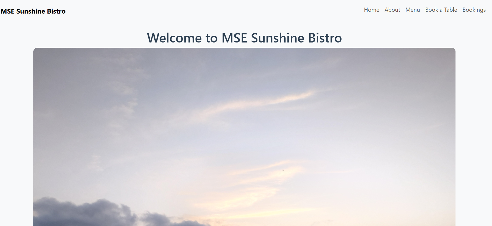
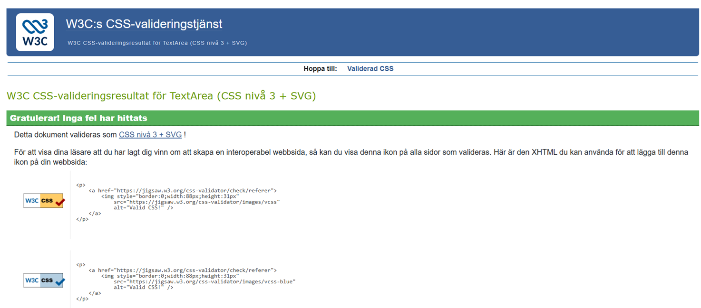
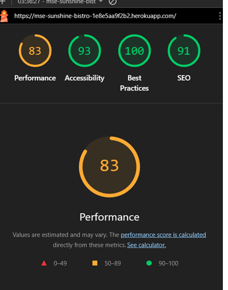
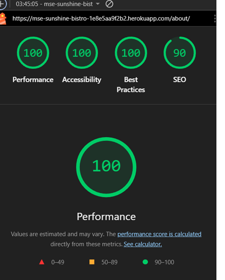
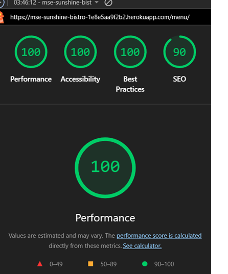
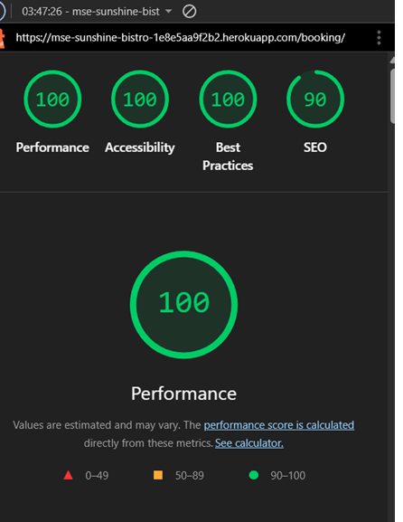
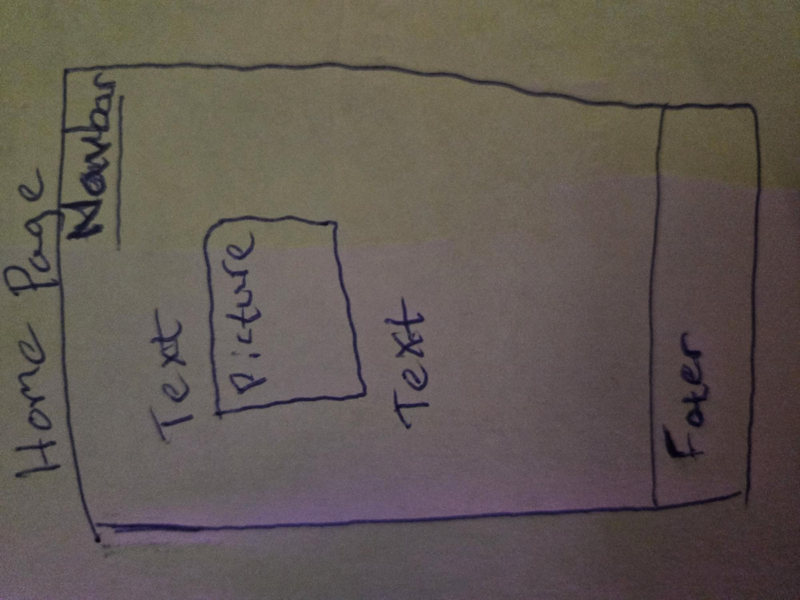
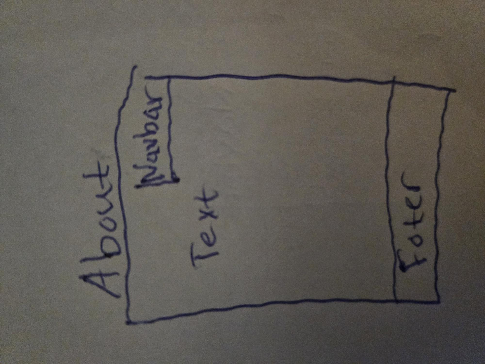
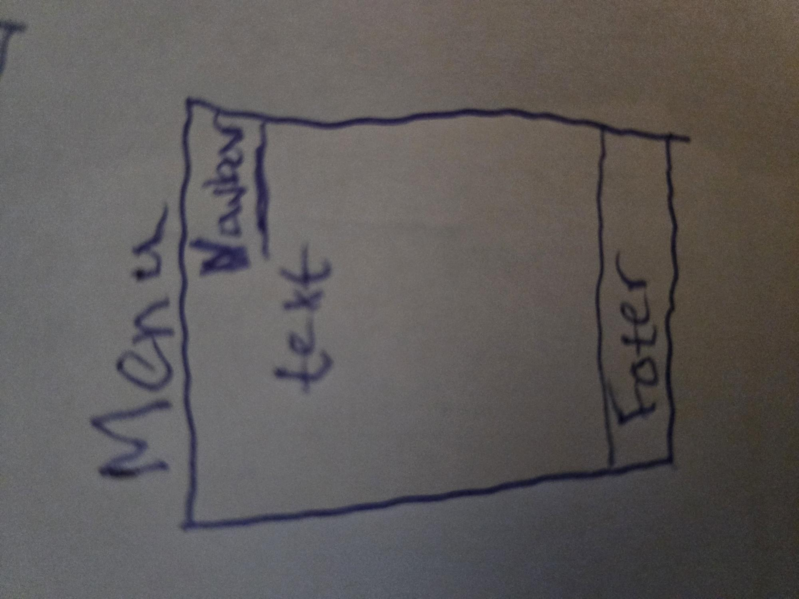
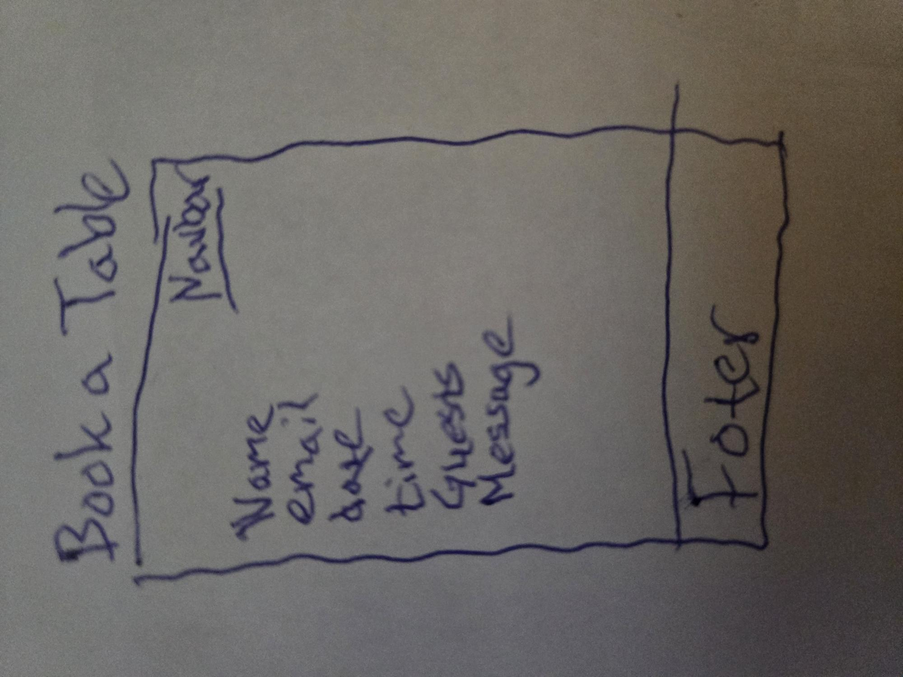

# Testing – MSE Sunshine Bistro

This document describes the testing carried out for the **MSE Sunshine Bistro** Django project.

---

## 1. Manual Testing

### 1.1 Navigation

All navigation links were tested both locally and on the deployed Heroku site.

**Tests performed**

- Clicked **Home** in the navbar  
  - Expected: Home page loads  
  - Result: ✅ Pass  

- Clicked **About**  
  - Expected: About page loads with restaurant information  
  - Result: ✅ Pass  

- Clicked **Menu**  
  - Expected: Menu page loads with example dishes  
  - Result: ✅ Pass  

- Clicked **Book a Table / Booking**  
  - Expected: Booking form page loads  
  - Result: ✅ Pass  

- Checked that the navbar and footer are visible on all main pages  
  - Result: ✅ Pass  

---

### 1.2 Home Page

- Hero image is shown correctly.
- Headline and introductory text are readable.
- Layout looks good on desktop and smaller widths.

**Screenshots**

Home page visual check (two parts due to height):

  

Result: ✅ Pass

---

### 1.3 About Page

- About text loads correctly.
- Page reachable via navbar.
- Footer appears at the bottom of the screen.

Result: ✅ Pass

---

### 1.4 Menu Page

- Menu page loads from navbar.
- Example dishes and layout display correctly.

Result: ✅ Pass

---

### 1.5 Booking Form

The booking form is a core feature and was tested with valid input.

**Fields tested**

- Name  
- Email  
- Date  
- Time  
- Guests  
- Message (optional)

**Valid booking**

- Filled in all required fields with sensible data:
  - Name: e.g. "Test User"
  - Email: e.g. "test@example.com"
  - Date: valid future date
  - Time: valid time
  - Guests: positive number
  - Message: optional text

- Expected result:
  - Form submits successfully
  - A success/confirmation message is shown to the user
  - Booking is created in the database and visible in the Django admin

Result: ✅ Pass  

(Invalid-input error screenshots were not captured due to time constraints, but the form was checked to prevent empty required fields.)

---

### 1.6 Admin Panel (Django Admin)

Tests performed on `/admin`:

- Logged in with superuser.
- Opened the **Booking** model.
- Verified that submitted bookings appear in the list.
- Checked that fields (name, date, time, guests, message) are stored correctly.
- Edited a booking and saved changes.

Result: ✅ Pass

---

## 2. Responsiveness Testing

Responsiveness was tested using Chrome DevTools device toolbar with several widths:

- Small mobile (e.g. ~375px wide)
- Tablet
- Desktop

Checks:

- Navbar remains usable and does not overlap content.
- Text remains readable without horizontal scrolling.
- Hero image on the home page scales to fit.
- Booking form fields remain usable on smaller screens.

Result: ✅ Pass

---

## 3. Browser Testing

The site was manually tested in:

- Google Chrome (desktop)
- Microsoft Edge (desktop)

In both browsers:

- All pages loaded correctly.
- Navigation links behaved as expected.
- Booking form submitted successfully.
- No obvious layout or CSS issues were observed.

Result: ✅ Pass

---

## 4. Validation

### 4.1 CSS Validation

The main stylesheet `static/css/style.css` was checked using the **W3C CSS Validator**.

Screenshot of the validation result:

Result: ✅ No critical errors reported.

### 4.2 HTML & Python

Full HTML and Python validation using external tools was **not fully completed** due to time constraints.

However:

- All templates were rendered and checked manually in the browser.
- The Django development server and the deployed Heroku app ran without syntax errors or import issues during testing.

Result: Manual sanity check ✅

---

## 5. Lighthouse Testing

Lighthouse audits were run in the browser dev tools for the main pages.  
Screenshots are stored in the `documentation/lighthouse/` folder.

### 5.1 Home Page

### 5.2 About Page

### 5.3 Menu Page

### 5.4 Booking Page

Overall, Lighthouse reported good scores for performance, accessibility and best practices.

---

## 6. Wireframes

Wireframes were created during the planning phase and are included for reference:

- Home page wireframe  
  

- About page wireframe  
  

- Menu page wireframe  
  

- Booking page wireframe  
  

These were used as a guide; the final implementation stays close to the overall structure while adjusting details during development.

---

## 7. User Story Testing (Summary)

### Site User

**US1 – View information about the restaurant**

- Action: Visit the Home and About pages.
- Expected: See basic information, welcome text and description of the restaurant.
- Result: ✅ Pass

**US2 – View the menu**

- Action: Visit the Menu page from the navbar.
- Expected: See example dishes and menu layout.
- Result: ✅ Pass

**US3 – Make a booking**

- Action: Use the Booking page form to send a booking request.
- Expected: Form submits with valid data, feedback is shown, and booking is stored.
- Result: ✅ Pass

**US4 – Navigate easily**

- Action: Use the navbar to move between Home, About, Menu and Booking.
- Expected: All links work; user understands where they are.
- Result: ✅ Pass

### Site Admin

**US5 – View bookings in the admin panel**

- Action: Log in to `/admin`, open Booking model.
- Expected: See all bookings submitted from the form.
- Result: ✅ Pass

**US6 – Update booking details**

- Action: Edit a booking entry in the admin and save.
- Expected: Changes persist and are shown on reload.
- Result: ✅ Pass

---

## 8. Known Issues

- Some additional automated validation (full HTML and Python linting) could be added in the future to further improve code quality.
- More extensive testing of edge cases in the booking form (e.g. past dates, extreme values) could be implemented.

At the time of submission, no major functional bugs are known.

---

## 9. Deployment Testing

The deployed site on Heroku was manually tested:

- Home page loads correctly and displays hero image and content.
- About, Menu and Booking pages are accessible from the navbar.
- Booking form submits successfully and data appears in the Django admin panel.
- Static files (including the hero image) load correctly.

Result: ✅ The deployed version behaves as expected.